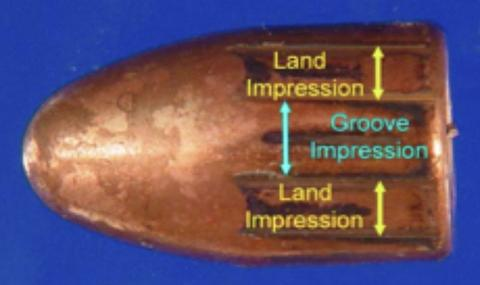

```{r,echo=FALSE, message=FALSE,warning=FALSE}
knitr::opts_chunk$set(cache=TRUE)
library(bulletr)
library(ggplot2)
library(knitr)
```

## Automatic groove identification <br> in 3D bullet land scans { .white }

<br><br><br><br><br><br><br>

<p class="white">
Kiegan Rice <br />
Iowa State University<br />
February 21st, 2018
</p> 


## Background: Bullet Lands


- When a gun is fired, the bullet is propelled forward through the barrel.  
- As the bullet travels down the barrel, it makes contact with parts of the barrel.  
- This is how we get striations!  
- We get two different types of areas on the bullet: the lands and the grooves.  

  


## Background: Collection of Land Data  


- Sensofar 3D Scanning Microscope  
- A scan of one bullet (6 individual lands) takes ~1 hour  

```{r, echo = F, warning = F, message = F}
bulletr::plot_3d_land(bullet = br411, sample = 2)
```

## Importance of Groove Removal  


- Bullet matching algorithm  
- Removing the underlying curved structure of land 
- Looking at remaining residuals 
    - Deviations from the natural curve of the land  
    


## Shortcomings of Current Methods


## Robust Linear Models  


  


## Groove Identification Process  


- Once we have the residuals, how do we decide where the cutoffs should be?  


## Results  


- We will look at all the residuals in the areas between our predicted grooves and the manually identified grooves  
- To assess each method, we can take the mean of these residuals for each method over the whole dataset  
- 208 total lands  


```{r, echo = F, warning = F, message = F}
result_table <- cbind(c(223.189, 239.6362), c(589.063, 229.614))
dimnames(result_table) <- list(c("Rollapply", "Quadratic"), c("Left Groove", "Right Groove"))
as.table(result_table)
```


## Acknowledgments  


- All work was sponsored by CSAFE (Center for Statistics and Applications in Forensic Evidence), a NIST Center of Excellence  


