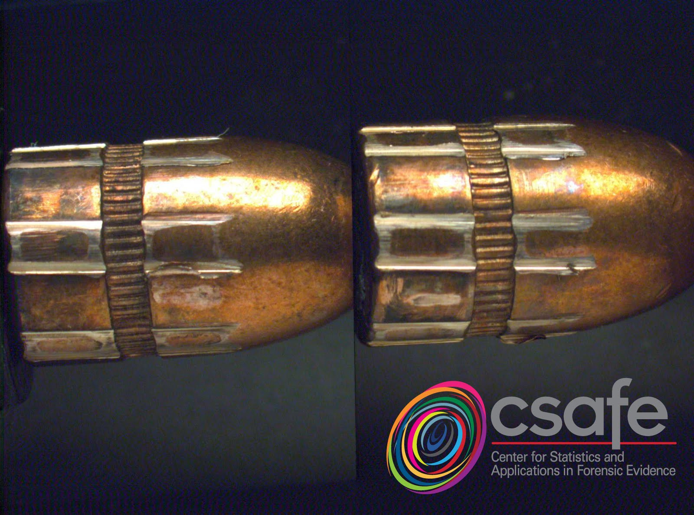
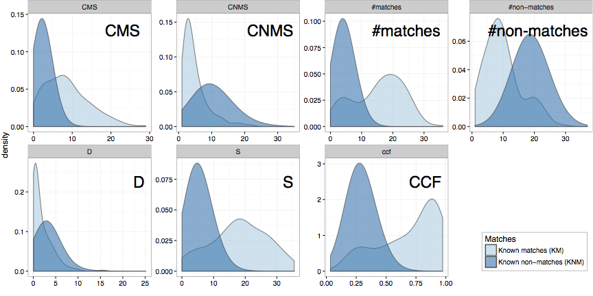
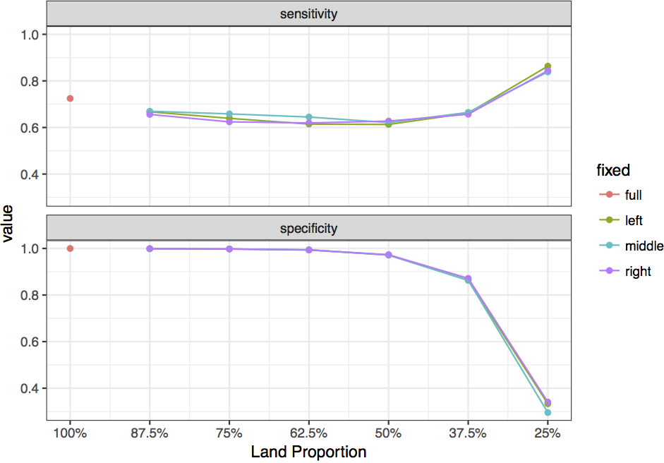
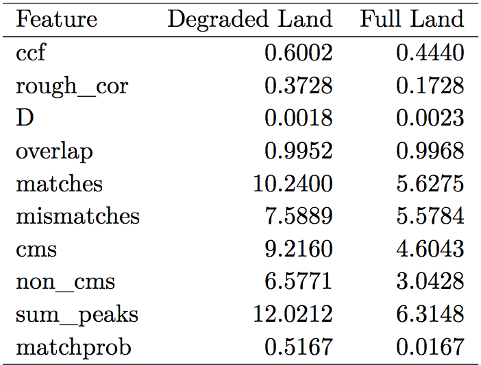

```{r,echo=FALSE, message=FALSE,warning=FALSE}
knitr::opts_chunk$set(cache=TRUE)
library(bulletr)
library(ggplot2)
library(knitr)
```

## Automatic Matching of Full and Degraded Bullet Lands { .white }

<br><br><br><br><br><br>

<p class="white">
Heike Hofmann, Eric Hare, Alicia Carriquiry<br />
Center for Statistics and Applications in Forensic Evidence<br />
Iowa State University<br />
May 18th, 2017
</p>


## Outline


- Same Source Problem: were two bullets fired through the same gun barrel?
- Besides visual inspection: score from Automatic Matching Algorithm based on 3d topographic images
- Score provides objective measure for the match (between 0 and 1, the higher the more likely the match) 
- Investigate properties of these scores


## x3p format: ISO 25178-72:2017

```{r, eval = TRUE, echo = FALSE, fig.height = 8, fig.width = 8}
library(bulletr)
plot_3d_land(path = "/Users/heike/papers/dissertations/eric-dissertation/images/Hamby (2009) Barrel/bullets/Br1 Bullet 1-5.x3p")
```

## Automated Matching Algorithm: Front-End Web Application


https://isu-csafe.stat.iastate.edu/shiny/bulletr/


## Automated Matching Algorithm


- initial image processing to extract relevant pattern

Step 1: extract profile

```{r step1, warning=FALSE, fig.height=4, echo = FALSE}
br111 <- get_crosscut(path="images/Br1 Bullet 1-5.x3p", x = 243.75)

qplot(y, value, data = br111) + theme_bw()
```


## Automated Matching Algorithm


- initial image processing to extract relevant pattern

Step 2: identify shoulders

```{r step2, dependson="step1", warning=FALSE, fig.height=4, echo = FALSE}
br111.gr <- bulletr::get_grooves(bullet = br111)

br111.gr$plot + xlab("y") + ylab("value") +
  geom_point(aes(x = y, y = value), data = br111)
```


## Automated Matching Algorithm


- initial image processing to extract relevant pattern

Step 3: long-pass Gaussiam filter

```{r, warning=FALSE, fig.height=4, echo = FALSE, message = FALSE}
br111.loess <- fit_loess(br111, br111.gr)
br111.loess$fitted
```

## Automated Matching Algorithm


- initial image processing to extract relevant pattern

Step 4: get land signature

```{r, warning=FALSE, fig.height=4, echo = FALSE}
br111.loess$resid +  ylab(expression(paste("Signatures (in ",mu,"m)", sep=""))) 

```


## Automated Matching Algorithm


- initial image processing to extract relevant pattern

Step 5: identify peaks 

```{r, warning=FALSE, fig.height=4, echo = FALSE}
br111.peaks <- get_peaks(br111.loess$data, smoothfactor=5)
ggplot() + geom_line(aes(y, resid), data = br111.loess$data, size=.5) +theme_bw() + geom_vline(aes(xintercept = peaks), colour="red", data.frame(peaks = br111.peaks$peaks)) + geom_vline(aes(xintercept = valleys), colour="steelblue", data.frame(valleys = br111.peaks$valleys)) +
      ylab(expression(paste("Signatures (in ",mu,"m)", sep=""))) 
```


## Automated Matching Algorithm


- initial image processing to extract relevant pattern

Step 6: align pairs of lands

```{r,echo=FALSE,message=FALSE,warning=FALSE, fig.height=4}
library(dplyr)

mypaths <- c("images/Br1 Bullet 1-5.x3p", "images/Br1 Bullet 2-1.x3p")
my_bullets <- lapply(mypaths, function(x) {
    result <- read_x3p(x)
    result[[3]] <- x
    names(result)[3] <- "path"
        
    return(result)
})
bullets_processed <- lapply(my_bullets, function(bul) {
    processBullets(bullet = bul, name = bul$path, x = 100)
})
names(bullets_processed) <- mypaths

bullets_smoothed <- bullets_processed %>% bind_rows %>% bulletSmooth

bAlign = bulletAlign(bullets_smoothed)
lofX <- bAlign$bullet  

b12 <- unique(bullets_smoothed$bullet)

peaks1 <- get_peaks(subset(lofX, bullet == b12[1]), smoothfactor = 25)
peaks2 <- get_peaks(subset(lofX, bullet == b12[2]), smoothfactor = 25)
peaks1$lines$bullet <- b12[1]
peaks2$lines$bullet <- b12[2]
peaks <- rbind(peaks1$lines, peaks2$lines)

ggplot() + theme_bw() +
    geom_rect(aes(xmin=xmin, xmax=xmax, fill=factor(type)), ymin=-6, ymax=6, 
              data=peaks,  alpha=0.2) +
    geom_vline(aes(xintercept=extrema, colour=factor(type)), 
               data= peaks, alpha=0.7) +
    scale_colour_brewer(palette="Set2") + 
    scale_fill_brewer(palette="Set2") +
    theme(legend.position="none") + 
    facet_grid(bullet~.) +
    geom_line(aes(x=y, y=l30, group=bullet), data=lofX) +
    ylab(expression(paste("Signatures (in ",mu,"m)", sep=""))) 
```

## Automated Matching Algorithm


- initial image processing to extract relevant pattern

Step 6 (cont'd): match peaks across lands

```{r, echo=FALSE, warning=FALSE, fig.height=5}
peaks1$lines$bullet <- b12[1]
peaks2$lines$bullet <- b12[2]

lines <- striation_identify(peaks1$lines, peaks2$lines)

ggplot() + 
  geom_rect(aes(xmin = xmin, xmax = xmax, fill=factor(type)), ymin = -6, ymax=6.5,  data = lines, alpha=0.2, show.legend = FALSE) +
  theme(legend.position="bottom") +
  geom_text(aes(x = meany), y= -5.5, label= "x", data = subset(lines, !match)) +
  geom_text(aes(x = meany), y= -5.5, label= "o", data = subset(lines, match)) +
  ylim(c(-6,6.5)) + theme_bw() +
  geom_line(data=lofX, aes(x=y, y=l30, group=bullet, linetype=bullet)) +
  scale_linetype_discrete("") +
  scale_colour_manual("", values=cols) +
  scale_fill_brewer("", palette="Set2", na.value=alpha("grey60", 0.5)) +
    theme(legend.position = "bottom",
        legend.background = element_rect(fill=alpha('white', 0.4))) + 
  ylab(expression(paste("Signatures (in ",mu,"m)", sep=""))) +
  xlab("y")
```


## Automated Matching Algorithm


- initial image processing to extract relevant pattern
- algorithm based on features extracted from pairwise comparison of profiles
- train algorithm on reference database
- get scores for new land-land comparisons


## Automated Matching Algorithm: Extract Features


Features are extracted from each land-to-land comparison:

- **ccf** (%) is the maximum value of the Cross-Correlation function evaluated at the optimal alignment. The CCF is defined as $C(\tau) = \int_{-\infty}^{\infty} f(t)g(t + \tau)dt$ where $\tau$ represents the the lag of the second signature [@vorburger:2011]. 
- **D** (mm) is the Euclidean vertical distance between each height value of the aligned signatures. This is defined as $D^2 = 1/n \times \sum_t (f(t) - g(t))^2$. Measure of the total variation [@clarkson1933definitions].
- **matches** is the number of matching peaks/valleys (striae) of the overlapping portion of the aligned signatures.

## More Features


- **mismatches** is the number of mismatching peaks/valleys (striae) of the overlapping portion of the aligned signatures.
- **cms** is the number of consecutively matching peaks/valleys (striae) of the overlapping portion of the aligned signatures [@biasotti:1959].
- **non_cms** is the number of consecutive mismatching peaks/valleys (striae) of the overlapping portion of the aligned signatures.
- **S** (mm) is the the sum of the average heights of matched striae.


## Reference database


- James Hamby Study: Ten consecutively rifled Ruger P-85 pistol barrels used to fire 20 "known" test bullets and 15 "unknown" bullets for comparison [@hamby:2009]
- Use 3d image of Hamby-252 as reference database to train the algorithm  
- Extract features for all land-land comparisons (21945 total)
- Compare differences in features between 7,075 **known matches** and 14,040 **known non-matches**


## Distribution of Features




## Data-driven rules


- data-driven decision rule (classification tree, Breiman et al 1984)
- tree creates MATCH/NO-MATCH decision for each **pair of lands** 
- in this tree: 1 false positive, 40 false negatives (for pairs of lands)


## Algorithm: Forest of 1000 trees


- Algorithm is based on 1000 trees, each tree gets a vote 


## Feature Importance


- ccf is good, but better in combination with other features


# How much of a land do we need for a match?

## Feature Standardization


- standardize features by the length of the recovered land
- this does not impact full lands, e.g. 
 here: Matches = 27, Matches per mm = 14.72


```{r,echo=FALSE,message=FALSE,warning=FALSE, fig.height=3}
library(dplyr)

mypaths <- c("images/Br1 Bullet 1-5.x3p", "images/Br1 Bullet 2-1.x3p")
my_bullets <- lapply(mypaths, function(x) {
    result <- read_x3p(x)
    result[[3]] <- x
    names(result)[3] <- "path"
        
    return(result)
})
bullets_processed <- lapply(my_bullets, function(bul) {
    processBullets(bullet = bul, name = bul$path, x = 100)
})
names(bullets_processed) <- mypaths

bullets_smoothed <- bullets_processed %>% bind_rows %>% bulletSmooth

bAlign = bulletAlign(bullets_smoothed)
lofX <- bAlign$bullet  

b12 <- unique(bullets_smoothed$bullet)

peaks1 <- get_peaks(subset(lofX, bullet == b12[1]), smoothfactor = 25)
peaks2 <- get_peaks(subset(lofX, bullet == b12[2]), smoothfactor = 25)
peaks1$lines$bullet <- b12[1]
peaks2$lines$bullet <- b12[2]
peaks <- rbind(peaks1$lines, peaks2$lines)

peaks$bullet <- gsub("images/", "", peaks$bullet)
peaks$bullet <- gsub(".x3p", "", peaks$bullet)

lofX$bullet <- gsub("images/", "", lofX$bullet)
lofX$bullet <- gsub(".x3p", "", lofX$bullet)

ggplot() + theme_bw() +
    geom_rect(aes(xmin=xmin, xmax=xmax, fill=factor(type)), ymin=-6, ymax=6, 
              data=peaks,  alpha=0.2) +
    geom_vline(aes(xintercept=extrema, colour=factor(type)), 
               data= peaks, alpha=0.7) +
    scale_colour_brewer(palette="Set2") + 
    scale_fill_brewer(palette="Set2") +
    theme(legend.position="none") + 
    facet_grid(bullet~.) +
    geom_line(aes(x=y, y=l30, group=bullet), data=lofX) +
    ylab(expression(paste("Signatures (in ",mu,"m)", sep=""))) 
```


## True Degraded Case


shorter signatures are not penalized (as much) by using standardized features

Here: Matches = 8 (full: 27), Matches per mm = 11.42 (14.72)

```{r,echo=FALSE,message=FALSE,warning=FALSE, fig.height=3}
library(dplyr)

mypaths <- c("images/Br1 Bullet 1-5.x3p", "images/Br1 Bullet 2-1.x3p")
my_bullets <- lapply(mypaths, function(x) {
    result <- read_x3p(x)
    result[[3]] <- x
    names(result)[3] <- "path"
        
    return(result)
})
bullets_processed <- lapply(my_bullets, function(bul) {
    processBullets(bullet = bul, name = bul$path, x = 100)
})
names(bullets_processed) <- mypaths

bullets_smoothed <- bullets_processed %>% bind_rows %>% bulletSmooth %>% filter((y > 0 & y < 1000 & bullet == "images/Br1 Bullet 2-1.x3p") | bullet == "images/Br1 Bullet 1-5.x3p")

bAlign = bulletAlign(bullets_smoothed)
lofX <- bAlign$bullet  

b12 <- unique(bullets_smoothed$bullet)

peaks1 <- get_peaks(subset(lofX, bullet == b12[1]), smoothfactor = 25)
peaks2 <- get_peaks(subset(lofX, bullet == b12[2]), smoothfactor = 25)
peaks1$lines$bullet <- b12[1]
peaks2$lines$bullet <- b12[2]
peaks <- rbind(peaks1$lines, peaks2$lines)

peaks$bullet <- gsub("images/", "", peaks$bullet)
peaks$bullet <- gsub(".x3p", "", peaks$bullet)

lofX$bullet <- gsub("images/", "", lofX$bullet)
lofX$bullet <- gsub(".x3p", "", lofX$bullet)

ggplot() + theme_bw() +
    geom_rect(aes(xmin=xmin, xmax=xmax, fill=factor(type)), ymin=-6, ymax=6, 
              data=peaks,  alpha=0.2) +
    geom_vline(aes(xintercept=extrema, colour=factor(type)), 
               data= peaks, alpha=0.7) +
    scale_colour_brewer(palette="Set2") + 
    scale_fill_brewer(palette="Set2") +
    theme(legend.position="none") + 
    facet_grid(bullet~.) +
    geom_line(aes(x=y, y=l30, group=bullet), data=lofX) +
    ylab(expression(paste("Signatures (in ",mu,"m)", sep=""))) 
```


## Standardized Features


- **matches** (per mm) is the number of matching peaks/valleys (striae) per millimeter of the overlapping portion of the aligned signatures.
- **mismatches** (per mm) is the number of mismatching peaks/valleys (striae) per millimeter of the overlapping portion of the aligned signatures.
- **cms** (per mm) is the number of consecutively matching peaks/valleys (striae) per millimeter of the overlapping portion of the aligned signatures [@biasotti:1959, @thompson:2013].
- **non_cms** (per mm) is the number of consecutive mismatching peaks/valleys (striae) per millimeter of the overlapping portion of the aligned signatures.
- **S** (per mm) is the the sum of the average heights of matched striae.

## Degraded Bullets


**Simulation Study**:

1. Three types of Degradation:
    a. **Left Fixed** - The left portion of the land (leading shoulder) is recoverable.
    b. **Middle Fixed** - The middle portion of the land is recoverable.
    c. **Right Fixed** - The right portion of the land (trailing shoulder) is recoverable.
2. Six Degradation Levels: 100% (Fully recovered), 87.5% Recovered, 75% Recovered, 62.5% Recovered, 50% Recovered, 37.5% Recovered,  25% Recovered.

## Simulation Results


- Sensitivity: correctly identify a known match (of a *pair of lands*)
- Specificity: correctly identify a known non-match (of a *pair of lands*)




## Testing this Finding


To come full circle, we will attempt to extract a 50% degraded signature from a Hamby bullet land with bad tank rash in one half. (Barrel 9 Bullet 2 Land 4):


## Br924 Results


Extracting the ideal signature and then simulating a left-fixed 50% degradation scenario yields the following:



# Future Work

## Reference Database {.small}

biggest limitation thus far is limited amount of available 3D scan data for bullets:

in NIST ballistics database (Xiaoyu Alan Zhang, https://tsapps.nist.gov/NRBTD):

- Hamby Set 252 (10 Barrels)
- Hamby Set 44 (Same 10 Barrels)
- Cary Persistence (1 Barrel)

11 unique gun barrels is not yet enough to form a true reference distribution for known matches and non-matches...

...However, the structure of the database means that as soon as new data is available, the features and scores can be easily recomputed.

please contribute your experimental data!

## Future work


- besides **open data** we need **open algorithms** and **open results** 
- comparison with other automated matching algorithms, e.g. Scratch 
- how much variability is introduced due to operator, lab, type of microscope? - great talk by Martin Baiker yesterday!
- importance of parameter choices / feature selection

## Thank You


Special thanks to Alan Zheng at the National Institute of Standards and Technology for maintaining the NIST Ballistics Toolmark Research Database and providing many useful suggestions.

## Announcement


-  CSAFE is the NIST Center of Excellence in Forensic Sciences.
- We are eager to engage the forensic community and get your input.
-  We are equipped to do 3D imaging of bullets, cartridge cases and other toolmarks and to analyze those images.
- IF YOU ARE A FIREARMS examiner and would like to visit Iowa State to learn about 3D surface analysis, please contact us.
- We can provide funding for travel and lodging while in Ames.
                    alicia@iastate.edu or hofmann@iastate.edu

## References

<!--
## Feature Expression


-->

