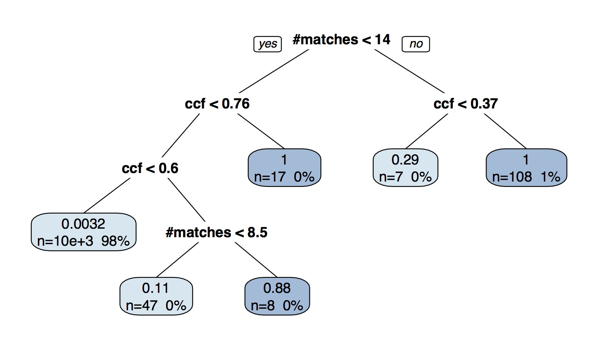
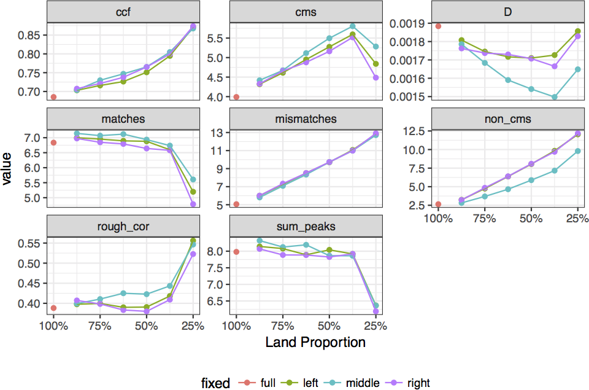

```{r,echo=FALSE, message=FALSE,warning=FALSE}
knitr::opts_chunk$set(cache=TRUE)
library(bulletr)
library(ggplot2)
library(knitr)
```

## Statistical and Algorithmic Approaches to Bullet Matching { .white }

<br><br><br><br><br><br>

<p class="white">
Heike Hofmann, Alicia Carriquiry, Eric Hare, Haley Jeppson<br />
Center for Statistics and Applications in Forensic Evidence<br />
Iowa State University<br />
June 8th, 2017
</p>


## Problem Statement


<div class="double">
<p class="double-flow">
<br>
Comparison Microscope
</p><p class="double-flow">
- **Same Source Problem:** were two bullets fired through the same gun barrel?
- Out approach similar to @Bachrach:2010bj: automatic matching introduces objective approach to matchign
- Automatic matching based on 3d topographic images
- Score in [0,1] with empirical distribution of known matches and known non-matches
</p>
</div>


## x3p format: ISO 25178-72:2017

```{r, eval = TRUE, echo = FALSE, fig.height = 8, fig.width = 8}
library(bulletr)
plot_3d_land(path = "/Users/heike/papers/dissertations/eric-dissertation/images/Hamby (2009) Barrel/bullets/Br1 Bullet 1-5.x3p")
```


## Automated Matching Algorithm


- Matching is based on features extracted from aligned land-to-land comparison: 
ccf [@vorburger:2011], 
total variation [@clarkson1933definitions], 
number striae, 
cms [@biasotti:1959], 
number non-alignments, ... 
- Used Random Forest [@Breiman:2001], but  other machine learning algorithms show similar performance; features are much more important than the algorithm

## Reference database


- James Hamby Study: Ten consecutively rifled Ruger P-85 pistol barrels used to fire 20 "known" test bullets and 15 "unknown" bullets for comparison [@hamby:2009]
- Use 3d image of Hamby-252 as reference database to train the algorithm  
- Extract features for all land-land comparisons (21945 total)
- Compare differences in features between 7,075 **known matches** and 14,040 **known non-matches**


## Results: Distributions of Known Matches and Known Non-Matches


<!--
## Data-driven rules


- data-driven decision rule (classification tree, Breiman et al 1984)
- tree creates MATCH/NO-MATCH decision for each **pair of lands** 
- in this tree: 1 false positive, 40 false negatives (for pairs of lands)


-->

## Algorithm: Forest of 1000 trees


- Algorithm is based on 1000 trees, each tree gets a vote 


## Automated Matching Algorithm: Front-End Web Application


https://isu-csafe.stat.iastate.edu/shiny/bulletr/


## Testing the Model


<div class="double">
<p class="double-flow">
<br>
</p><p class="double-flow">
- Phoenix PD: 8 barrels (with 2 test firings), 2 unknowns
- 3d imaging by Sensofar (thanks, Bill!)
- Scans by different operator, on different microscope, different staging of the bullets, different resolution
- Results are *promising*
</p>
</div>

## Testing the Model (cont'd)


<div class="double">
<p class="double-flow">
How much land do we need for a match?

<br>
</p><p class="double-flow">
- error rates seem stable down to about 50% of a land
- middle of the land seems slightly better (not significant)
</p>
</div>

## Limitations {.small}

biggest limitation thus far is limited number of available 3D scan data for bullets:

in NIST ballistics database (Xiaoyu Alan Zhang, https://tsapps.nist.gov/NRBTD):

- Hamby Set 252 (10 Barrels)
- Hamby Set 44 (Same 10 Barrels)
- Cary Persistence (1 Barrel)

11 unique gun barrels is not yet enough to form a true reference distribution for known matches and non-matches...

...However, the structure of the database means that as soon as new data is available, the features and scores can be easily recomputed.

please contribute your experimental data!

## Transparency & Reproducibility

- *Open Data*: [NIST ballistics database](https://tsapps.nist.gov/NRBTD), locally we are in the process of (re-) scanning Hamby-44 and Hamby-259
- *Open Algorithms*: `bulletr` is R package on CRAN with functionality for read/write x3p format, feature extraction and matching algorithms, [devel version on github](http://github.com/erichare/bulletr)
- *Open Results*: local database with processed land scans; actual future work: submit scores for land-to-land comparisons from different approaches/institutions/labs to database

## Future work

1. improve matching:
    * importance of parameter choices
    * expand on features, e.g. adapt toolmark scores to bullet lands
    * profile extraction (groove detection, area of extraction)
1. investigate sources of (statistical) error: how much variability is introduced due to operator, lab, type of microscope? (ties into efforts by Martin Baiker from NFI and NIST)
1. expand on applications: e.g. primer shearing marks? 
<!-- Primer shearing marks:	Striated toolmarks caused by the rough margins of a firing pin hole (aperture) scraping the primer metal during unlocking of the breech of a firearm -->


## Thank You


Special thanks to Alan Zheng at the National Institute of Standards and Technology for maintaining the NIST Ballistics Toolmark Research Database and providing many useful suggestions.


## References {.small}

<!--
## Feature Expression


-->

