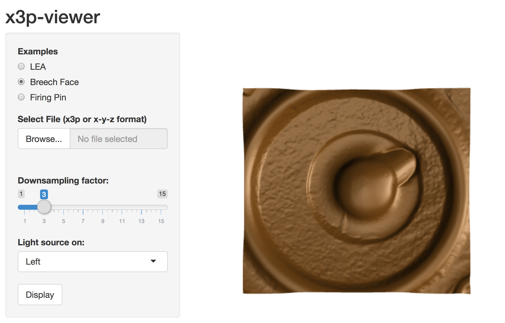
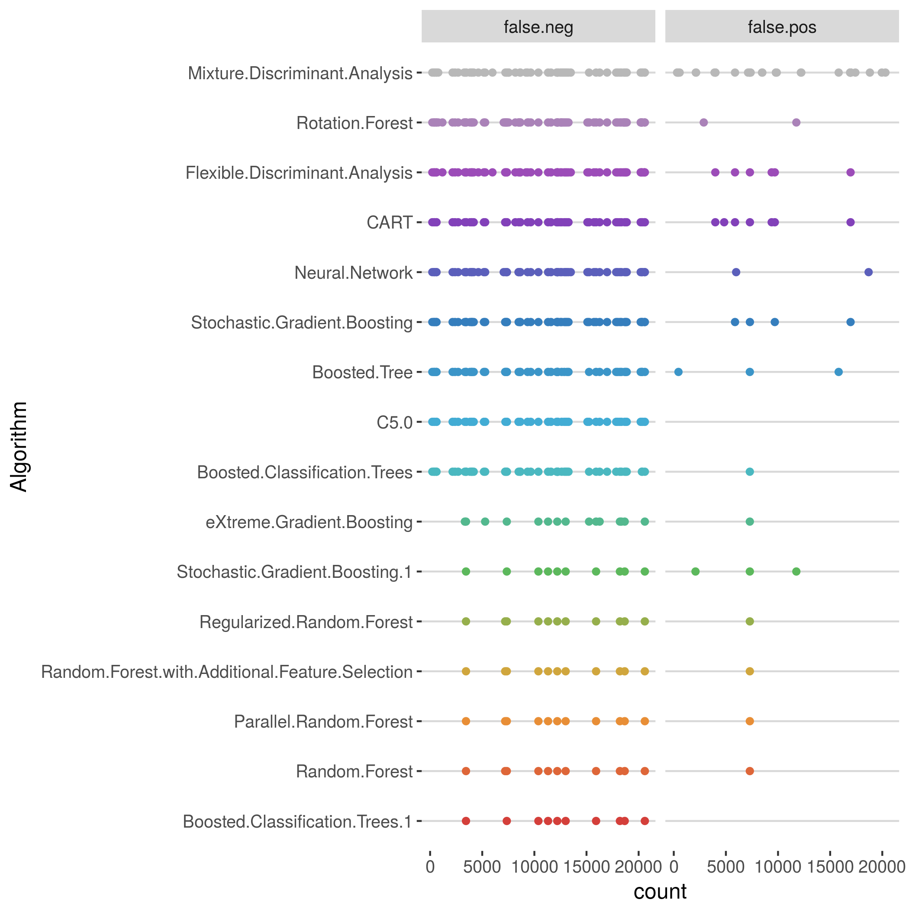
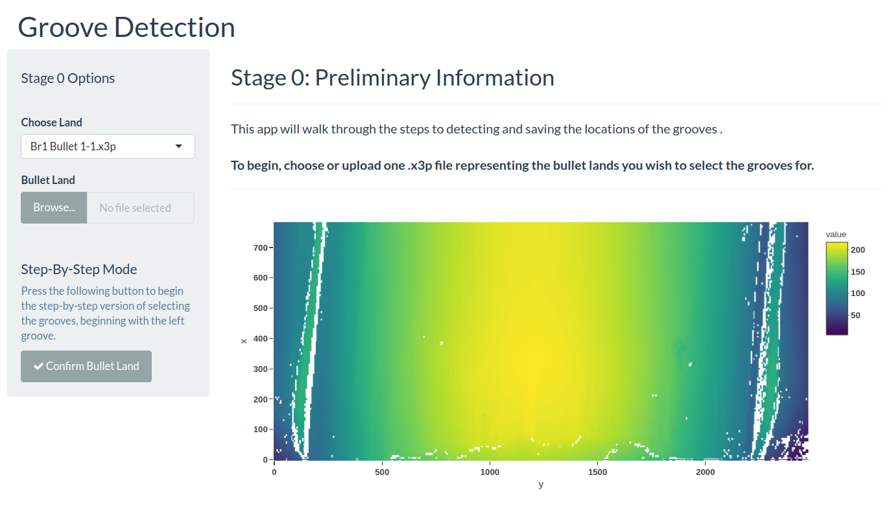
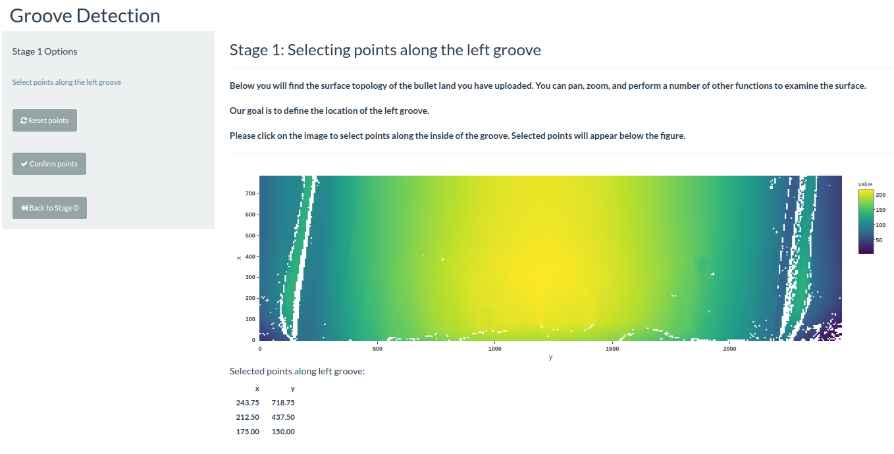
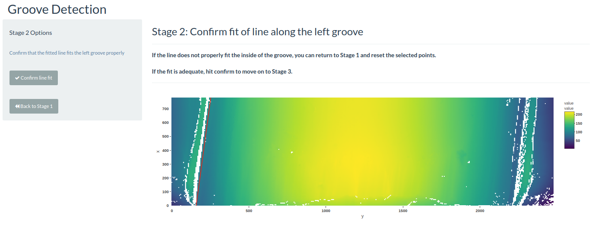
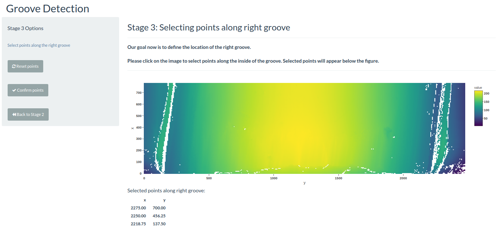
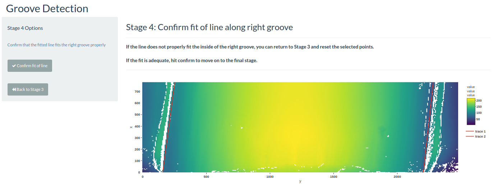
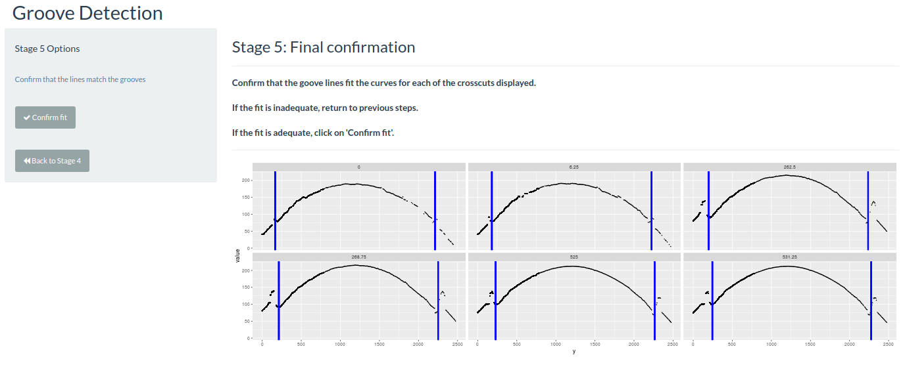
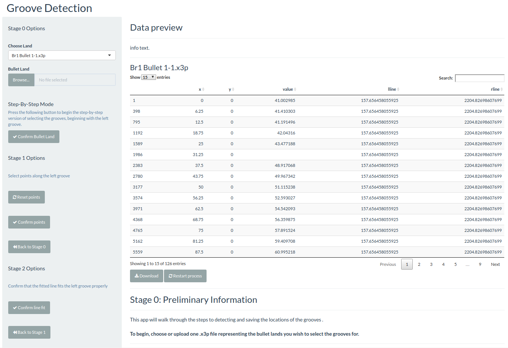

```{r setup, include=FALSE}
knitr::opts_chunk$set(
	echo = FALSE,
	message = FALSE,
	warning = FALSE
)
library(tidyverse)
```

## Outline

- x3p format and viewer
- example application: groove finding 

# x3p format and viewer

## x3p format: ISO 25178-72:2017

- x3p format: standardized format (ISO and DIN) for surface measurements
- ML based format that allows to store measurements together with meta-information (operator, resolution, machine, ... )
- adapted by Open Forensic Metrology Consortium for metrology data
- 'buy-in' by academic and industry partners (supported by NanoFocus, Alicona, and Sensofar among others)
- [NIST ballistics database](https://tsapps.nist.gov/NRBTD) provides files for bullet lands, breech faces,  firing pin impressions, ... in x3p format
- Problem: no 'easy' platform independent x3p viewer

## Example of an x3p viewer

- programmatic solutions: Matlab or R
- land engraved area for bullet (part of Hamby set) 

```{r, eval = TRUE, echo = FALSE, fig.height = 6, fig.width = 6}
library(bulletr)
plot_3d_land(path = "/Users/heike/papers/dissertations/eric-dissertation/images/Hamby (2009) Barrel/bullets/Br1 Bullet 1-5.x3p")
```

## x3p-viewer

- web app: [https://isu-csafe.stat.iastate.edu/shiny/x3p-viewer/](https://x3p-viewer.shinyapps.io/x3p-viewer/)
- primitive viewer of x3p and x-y-z data
- allows sub-sampling, basic lighting and snapshots




## Technical details

- browser app, i.e. platform independent with only a browser requirement
- app hosted on csafe server
- implemented in R; packages used are `shiny`, `rgl` (source code available from csafe github portal)


# Example app: groove-finder

## Same-source matching algorithm

- data: 3d topographic surfaces of land engraved areas
- derive score for land-land comparison to quantify how closely they match  based on extracted features
- next step: diagnose model


## Maximize matching accuracy

We fir different machine learning algorithms to try to maximize accuracy

| Algorithm                                       | Accuracy  |
|-------------------------------------------------|-----------|
| Boosted Classification Trees                    | 0.9995218 |
| Random Forest                                   | 0.9994261 |
| Parallel Random Forest                          | 0.9994261 |
| Random Forest with Additional Feature Selection | 0.9994261 |
| Regularized Random Forest                       | 0.9994261 |
| Stochastic Gradient Boosting                    | 0.9993783 |
| eXtreme Gradient Boosting                       | 0.9992348 |
| Boosted Classification Trees                    | 0.9975132 |
| C5.0                                            | 0.9974175 |
| Boosted Tree                                    | 0.9973697 |
| Stochastic Gradient Boosting                    | 0.9970827 |
| Neural Network                                  | 0.9970349 |
| CART                                            | 0.9968914 |
| Flexible Discriminant Analysis                  | 0.9965567 |
| Rotation Forest                                 | 0.9965088 |
| Mixture Discriminant Analysis                   | 0.9952654 |

## Maximize matching accuracy (cont'd)

- most ML algorithms produce errors in the same land-land comparison

```{r, out.width = "500px"}

```

## Locating errors

- most misclassifications are due to a problem with the scans (and resulting problems in calculating features) rather than an issue with the algorithm

- enhance classification performance by improving the methods used to obtain scans and to calculate the variables, rather than by improving the algorithm used

- errors in groove identification turned out to be particularly problematic in the downstream process

## Errors with groove detection

- images or signatures without grooves 

```{r, fig.width=7, fig.height = 7}
b1 <- bulletr::read_x3p("Br1 Bullet 2-3.x3p")
b1_df <- bulletr::fortify_x3p(b1) 
bulletr::plot_3d_land(bullet=b1)
```

## Errors with groove detection

```{r}
b1_df %>% filter(between(x, 100,110)) %>%
  ggplot(aes(x = y, y = value)) + geom_point(size=.1)
```

## App for groove detection

- To obtain the dataset, the "groove detection" app was created
- easy usable shiny app was for manually locating left and right groove of every bullet land image: upload  x3p image, walk through the steps to identify the locations of the grooves, then save a data frame that has the left and right groove 

[demo](https://haley.shinyapps.io/grooves/)

## Groove Detection: Stage 0

```{r, out.width = "800px"}

```

## Groove Detection: Stage 1

```{r, out.width = "800px"}

```

## Groove Detection: Stage 2

```{r, out.width = "800px"}

```

## Groove Detection: Stage 3

```{r, out.width = "800px"}

```

## Groove Detection: Stage 4

```{r, out.width = "800px"}

```

## Groove Detection: Stage 5

```{r, out.width = "800px"}

```

## Groove Detection: Final Stage


```{r, out.width = "800px"}

```


## Conclusion/Further Work

- shiny apps are a (relatively) easy way of creating non-technical user interfaces 
- surprisingly(?) we turned into our own first user
- easy to use, 'simple' visualizations can be extremely powerful
- shiny apps are hosted on the servers at CSAFE


